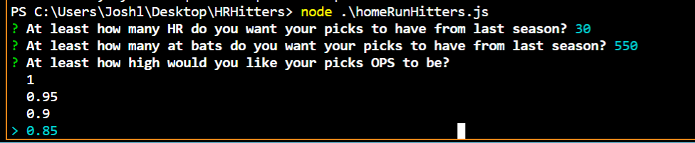
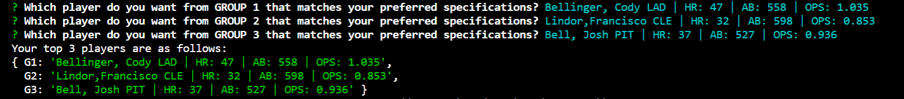
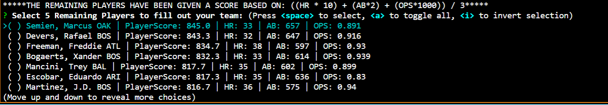
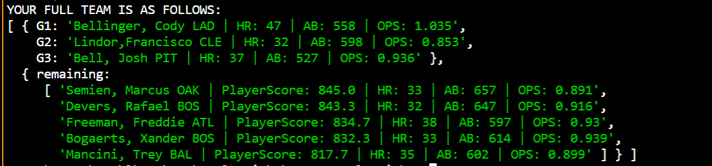

# HR Hitters
An algorithm to predict the top MLB homerun hitters going into the next season

## Motivation
Each year my family has a contest to see who can select the top 8 players with the most HomeRuns in the MLB for a small pot of money but mainly for the bragging rights.  After a long discussion with the "old man" about which was the best selection method, data analysis or good old fashioned "going with your gut", I decided to write this program.  

## Tech Used
This is a node.js terminal based application that uses npm inquirer prompting the user to answer questions and make selections in response.

## Selection Process
1. There are 3 groups of 5 players each that are pre-selected (these are some of the best Homerun hitters from the previous MLB season).  
2. The user must select 1 player from each of these 3 pre-selected groups.
3. After a player is selected from each group, the rest of the players in that group are discarded and CANNOT BE SELECTED AT ANY TIME.
4. After the top 3 players are selected, the user may select any other 5 MLB players to fill out their roster.

## Usage and Functionality
The players used in this app are stored in a JSON object I have created.  This object includes 2019 MLB season's top 50 homerun hitters and their cooresponding stats.

Step 1: The user is first prompted to select how important various statistics are to the selection of thier top 3 players.  Inquirer is invoked, asking the user to select the minimum preferred statistics in Homeruns, At-bats, and OPS (On base % plus Slugging %).

Step 2: Upon selecting the minimum preferred statistics, HR Hitters returns a list from each group that matches the users required specifications.  If no players in a group meet these minimums, the user is informed and all players from that group are returned for further user evaluation. After the top 3 players are selected HR Hitters logs these players to the console and discards the remaining players from each group, which now cannot be selected at any point.  

Step 3: The remaining players from the top 50 are given an average "PlayerScore" based on the following equation (((HR * 10) + (AB * 2) + (OPS * 1000)) / 3).  They are then ordered by PlayerScore and listed for selection.  The user must select exactly 5 players from these remaining players.  If the user attempts to select more or fewer than 5 players, they are informed, and asked to continue the selection process until 5 players are selected.

Step 4:  When exactly 5 players have been selected the final team is logged to the console for viewing!

